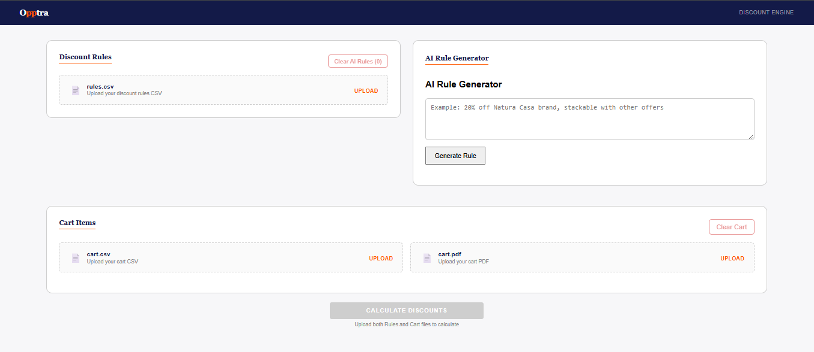
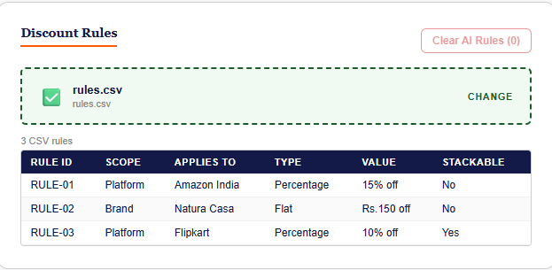
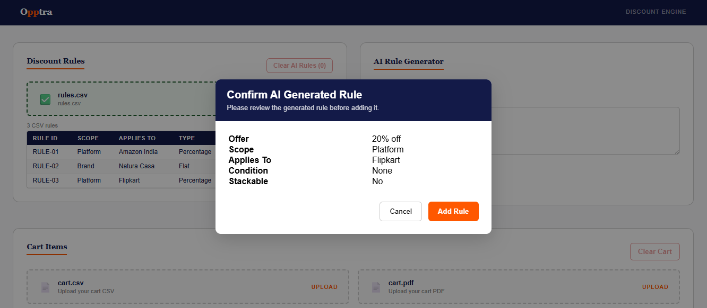
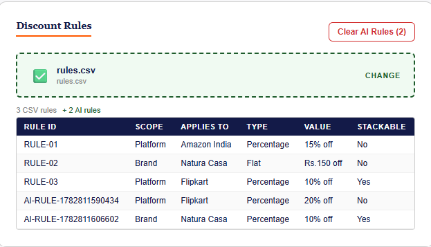
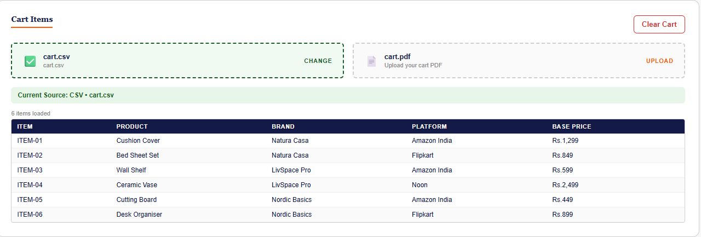
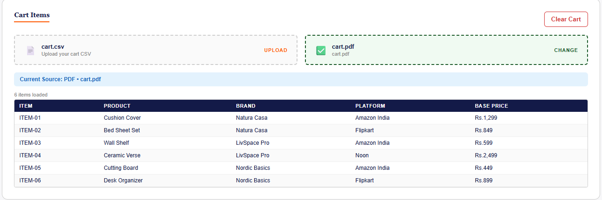
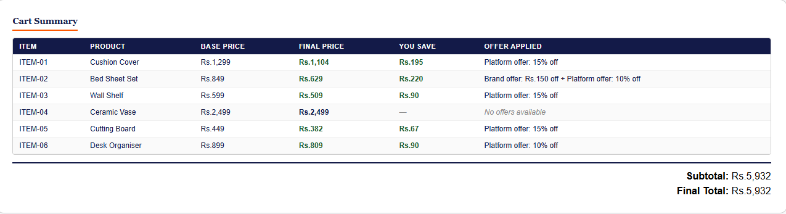
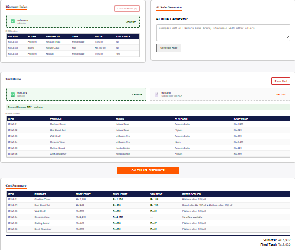

# Discount Engine | Opptra Frontend Developer Internship Assessment

This is my implementation of the **Opptra Frontend Developer Internship Assignment**.

In addition to the required functionality, this implementation extends the base assignment with **AI-assisted rule generation**, **PDF cart upload**, **structured PDF parsing with AI fallback**, and several usability improvements while keeping the core discount engine fully deterministic.

---

## Live Demo

🌐 **Deployed Application:**  
https://discount-engine-assignment-theta.vercel.app/

## Repository

📂 **GitHub Repository:**  
https://github.com/Abhay-SKulkarni123/discount-engine-assignment.git

---

# Features

### Assignment Requirements

- ✅ Discount Rules CSV Upload
- ✅ Cart CSV Upload
- ✅ Deterministic Discount Engine
- ✅ Stackable Discount Rules
- ✅ Cart-level Discount Support
- ✅ Results Summary
- ✅ Error Handling

### Additional Enhancements

- 🚀 PDF Cart Upload
- 🚀 Structured PDF Parsing
- 🚀 AI-powered PDF Parsing Fallback
- 🚀 Natural Language Discount Rule Generator (Gemini)
- 🚀 AI Rule Confirmation Dialog
- 🚀 Manual Discount Calculation Workflow
- 🚀 Current Cart Source Indicator
- 🚀 Clear Cart
- 🚀 Clear AI Rules
- 🚀 Smooth Auto-scroll to Results

---

# Running locally

```bash
npm install
npm run dev
```

Open

```
http://localhost:5173
```

---

# Deploying

```bash
npm run build
```

Deploy the generated `dist/` folder to **Vercel**, **Netlify**, or any static hosting provider.

🌐 **Live Application:** https://your-vercel-url.vercel.app

---

## Walkthrough Demo

A short walkthrough demonstrating the complete application workflow on the live deployment.

**Loom Walkthrough:**  
https://www.loom.com/share/0ecf16814e51480d8b4c45bb33352659

# How to use

1. Upload `sample-data/rules.csv` as the discount rules input.
2. Upload either `sample-data/cart.csv` or `sample-data/cart.pdf` as the cart input.
3. (Optional) Generate a discount rule using natural language and confirm it.
4. Click **Calculate Discounts** to evaluate the cart.

# Project structure

```text
src/
│
├── components/
│   ├── CsvUploader.jsx
│   ├── PdfUploader.jsx
│   ├── RuleInput.jsx
│   ├── RulePreview.jsx
│   ├── DataTable.jsx
│   └── ErrorBanner.jsx
│
├── engine/
│   ├── csvParser.js
│   ├── pdfParser.js
│   └── discountEngine.js
│
├── hooks/
│   └── useRuleGenerator.js
│
├── services/
│   └── aiService.js
│
├── App.jsx
└── main.jsx

sample-data/
├── rules.csv
├── cart.csv
└── cart.pdf
```

---

# CSV formats

## rules.csv

| Column | Type | Example |
|------------|-------------------|------------------|
| rule_id | string | RULE-01 |
| scope | brand \| platform | platform |
| applies_to | string | Amazon India |
| type | percentage \| flat | percentage |
| value | number | 15 |
| stackable | true \| false | false |

---

## cart.csv

| Column | Type | Example |
|------------|--------|--------------|
| item_id | string | ITEM-01 |
| product | string | Cushion Cover |
| brand | string | Natura Casa |
| platform | string | Amazon India |
| base_price | number | 1299 |

---

# Discount logic

- When multiple non-stackable rules match an item, the rule giving the **largest saving in rupees** is selected.
- Rules marked `stackable: true` apply **after** the winning non-stackable rule.
- If no rules match, the original base price is returned with **"No offers available"**.
- Cart-level discounts are applied after all item-level discounts have been calculated.

---

# Expected results for the sample data

| Item | Base Price | Final Price | Reasoning |
|---------|-----------|-------------|----------------------------------------|
| ITEM-01 | Rs.1,299 | Rs.1,104 | Platform offer: 15% off (beats Rs.150) |
| ITEM-02 | Rs.849 | Rs.629 | Brand offer: Rs.150 off + Platform 10% |
| ITEM-03 | Rs.599 | Rs.509 | Platform offer: 15% off |
| ITEM-04 | Rs.2,499 | Rs.2,499 | No offers available |
| ITEM-05 | Rs.449 | Rs.382 | Platform offer: 15% off |
| ITEM-06 | Rs.899 | Rs.809 | Platform offer: 10% off |

---

# AI Features

## Natural Language Rule Generation

Example prompt

```
20% off Natura Casa
```

The generated rule is validated and displayed in a confirmation dialog before being added to the active rule set.

---

## PDF Cart Upload

The application supports uploading shopping carts as PDF files.

Parsing follows a two-stage strategy:

1. Structured Parser
2. Gemini AI Fallback

This provides deterministic parsing whenever possible while still supporting semi-structured PDFs.

---

# Screenshots

## Home



---

## Rules Upload



---

## AI Rule Generator



---

## AI Rules Upload



---

## CSV Upload



---

## PDF Upload



---

## Final Calculations



---

## Results



---

# Assignment Enhancements

Compared to the provided starter implementation, this project additionally includes:

- PDF cart upload support
- Structured PDF parsing
- AI-powered PDF parsing fallback
- Natural language discount rule generation
- AI rule confirmation workflow
- Manual discount calculation flow
- Current cart source indicator
- Clear Cart functionality
- Clear AI Rules functionality
- Improved error handling
- Smooth scroll to results

---

# Author

**Abhay S. Kulkarni**

Submitted for the **Opptra Frontend Developer Internship Assignment**.